# Linux-Practice-Project

This Project ios about the implementation of some basic linux commanmds

## Sudo Command

The Sudo command known as the super uiser do command which is used to grant administrative priviledgeds to a certain user to manipulate root files and others.

To use sudo command we use the folliwing syntax `sudo apt upgrade`

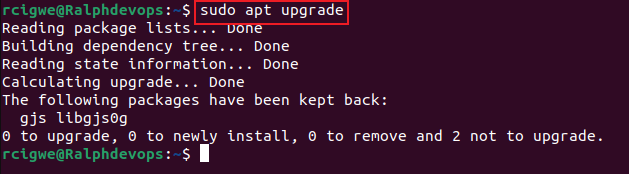

## PWD Command

This command is used to find your current/present working directory. Paths such as directories that start with a forward slash ( / ). ie, `/home/ubuntu`

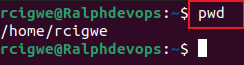 

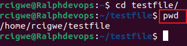

## CD Command 

The cd command is used to navigate through the linux files and directories. The directory name or full path is required. for example if you run this command without an `option`, it will take you to the `home folder`. see below

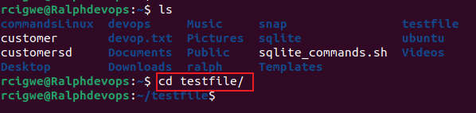

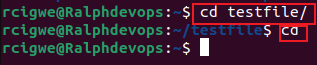

## ls Command 

The ls command also known as list. when used, it will display all files and directories within a system. when run with some flag, it reveal some hidden files in addition with the visible ones

ls-a With a flag

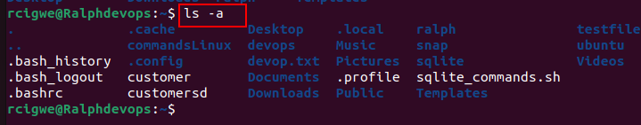

ls no flag 

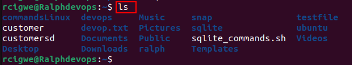

LS -R

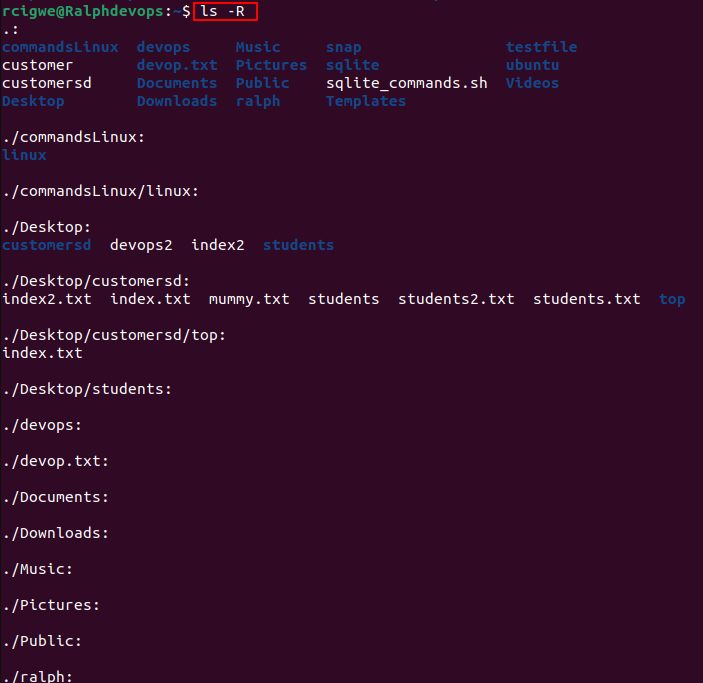

## Cat Command

Also Known as `Concatenate`, the cat commend Is one of the most frequently used Linux Commands. its functions are: `Lists`, `combines` and `writes` file content to the standard output.

Creating a File

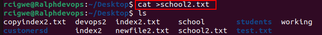

displayint file content

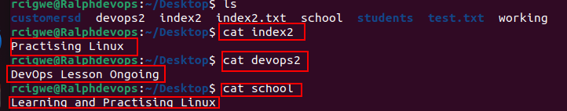

Arranging file content 

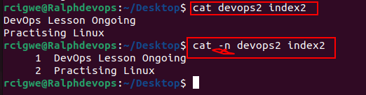

As earlier mentioned, there are many uses of cat in `Linux`

## cp Command

This Command is used to `Copy` files or directories and their content.

For Example
Copy File

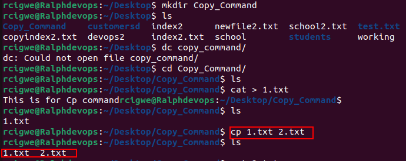

Copy into another Directory

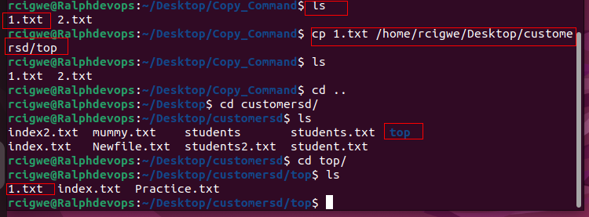

## mv Command

The MV command is used to `move` and in addition `rename` files and directories and produces no output upon execution.

For Example

`Move` 

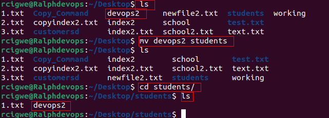

`Rename` 

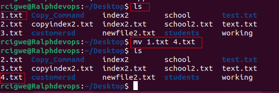

## mkdir Command

mkdir known as `make directory` is a command used to create one or multiple directories at once while setting permissions for each of them.  

The Basic syntax is `mkdir [option] directory_name`

For example 

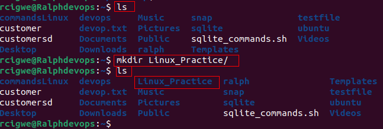

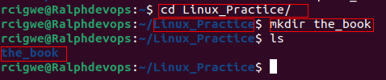

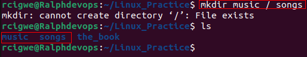

## rmdir Command

This is used to delete permantly an empty directory. The user must have sudo priviledges.

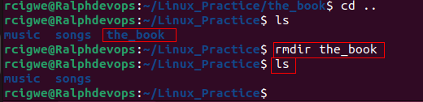

## rm Command 

The rm command's function is to delete files within a directory.

For example:

## Touch Command 

This Command will allow you create an empty file and can also allow you generate and modify a timestamp in the Linux command line.

For example.

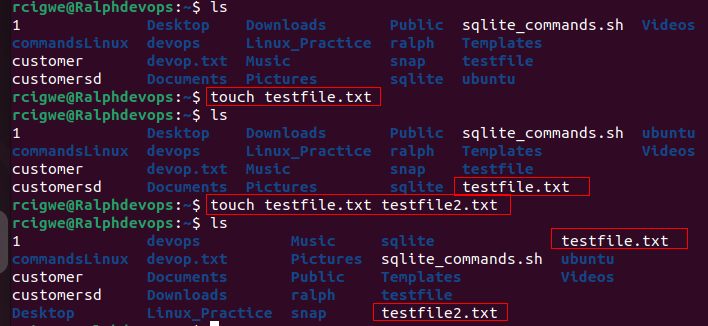

## locate Command

The locate command is used to find a file in the database system. In addition, adding the -i argument turns off case sensitivity, so a file can be searched even without knowing its exat name. 

For example, to search for content that contains two or more words, we use asterisk (*). 

locate customer 

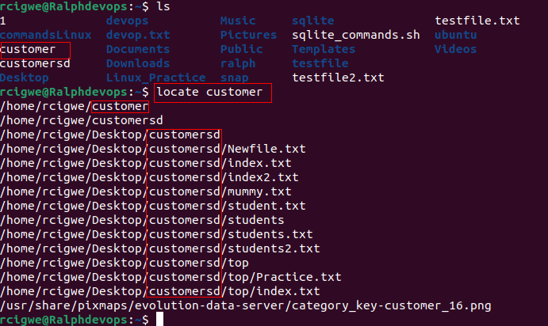

