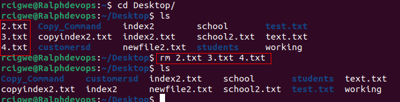
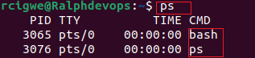
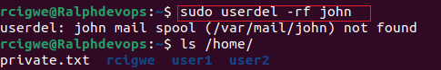

# Linux-Practice-Project

This Project ios about the implementation of some basic linux commanmds

## Sudo Command

The Sudo command known as the super uiser do command which is used to grant administrative priviledgeds to a certain user to manipulate root files and others.

To use sudo command we use the folliwing syntax `sudo apt upgrade`

## PWD Command

This command is used to find your current/present working directory. Paths such as directories that start with a forward slash ( / ). ie, `/home/ubuntu`

 

## CD Command 

The cd command is used to navigate through the linux files and directories. The directory name or full path is required. for example if you run this command without an `option`, it will take you to the `home folder`. see below

## ls Command 

The ls command also known as list. when used, it will display all files and directories within a system. when run with some flag, it reveal some hidden files in addition with the visible ones

ls-a With a flag

ls no flag 

LS -R

## Cat Command

Also Known as `Concatenate`, the cat commend Is one of the most frequently used Linux Commands. its functions are: `Lists`, `combines` and `writes` file content to the standard output.

Creating a File

displayint file content

Arranging file content 

As earlier mentioned, there are many uses of cat in `Linux`

## cp Command

This Command is used to `Copy` files or directories and their content.

For Example
Copy File

Copy into another Directory

## mv Command

The MV command is used to `move` and in addition `rename` files and directories and produces no output upon execution.

For Example

`Move` 

`Rename` 

## mkdir Command

mkdir known as `make directory` is a command used to create one or multiple directories at once while setting permissions for each of them.  

The Basic syntax is `mkdir [option] directory_name`

For example 

## rmdir Command

This is used to delete permantly an empty directory. The user must have sudo priviledges.

## rm Command 

The rm command's function is to delete files within a directory.

For example:

## Touch Command 

This Command will allow you create an empty file and can also allow you generate and modify a timestamp in the Linux command line.

For example.

## locate Command

The locate command is used to find a file in the database system. In addition, adding the -i argument turns off case sensitivity, so a file can be searched even without knowing its exat name. 

For example, to search for content that contains two or more words, we use asterisk (*). 

locate customer 

## Find Command 

Again, this command is used to `search for files and directories` and perform subsequent operations on them

It supports searching by file, folder, name , creation date, modification date, owner and permmissions.

For Example

$ Find . -name testfile.txt

## grep Command

known as `global regular expression print` grep. 

Used to search for a word by searching through all the texts in a specific file. Once a match is found, it prints all lines containing the specific word. The command helps in filtering through large files.

## df Command

This Command is used to report system's disc space usage, it shows it in percentage and kilobyte.

## du Command

Used to check how much space a file or a directory takes up in your machine. It can equally be used to identify the part of the system that uses storage excessively.
Directory path must be specified when in use.

For Example

## head Command

This command allows viewing of `top ten lines` of a text or specified files.
By Default, it prints the `first 10 lines` of the specified file. 
If more than one file name is provided then data from each file is preceded by its file name.

For Example

## tail Command 

The tail command displays the `last ten lines` of a file. It is used to check if a file has a new data or to read error messages.
By Default, it prints the `last 10 lines` of the specified file. 
If more than one file name is provided then data from each file is preceded by its file name.
 

## diff Command

The diff Command tells us when two files are compare, which line in a file has to be changed to make the two files identical.
It is used by programmers to alter a programme instead of rewriting the entire code.

For  example

## tar Command 

The tar commanmd is the linux version of ZIP, used for archiving multiple files into a TAR file, with optional compression .

for example

# File Permission and Ownership

## chmod Command

This command is used to modify a file or directories read, write and execute permissions.
Files are normally associated with three user classes which are - owner, group member and others.

for example

## chown Command

This command allows you to change the ownership of a file, directory or symbolic link to a specified username 

for example

## jobs Command

Job is a process started by the shell. The job command will display all running processes, however, it is only available in csh, bash, tcsh and ksh shells.

Examples:

## kill Command

This command is used to manually `terminate` unresponsive programme. It will signal misbehaving applications and instruct them to close their processes.

## ping Command

ping is used to test mainly for connectivity such as a network or a server if they reacheable or connected.

Used to test network intefrface card and test DNS name resolution issues.

For Example

## wget Command

wget is a command line utility which is used in `downloading files from the web`.
The command retrieves files using HTTP, HTTPS and FTP protocals

## uname Command

The uname command prints detailed information about Linus system and hardware, these includes machine name, operating system and kernel.

for example

## top Command

This Command will display all the running processes and a dynamic real-time view of the current system
It sums up the resource utilization crom CPU to memory usage.

for example

## history Command

history command system will list up to 500 previously executed commands for you to reuse without re-entering. Running this utility depends on Linux shell type.

## man Command

This command is the user manual for most commands or utilities you can run in Terminal, including the name, discription and option.

## echo Command

The echo command a built-in utility that displays a line of text or string using the standard output.

## zip, unzip Commands

Zip command is used to compress files into a zip file.

## useradd, userdel Command

The Useradd command is used to `crate new user account in Linux`. Linux is a multiuser system so more than one person can use it simultaneously. 
When useradd command is used it performs some major changes

for example

## hostname Command 

Thsi command will show the `system host name`. it can be executed without and option

## apt-get Command 

A command for handling Advance Package Tool in Linux. It allows for `information and bundle retrival` from authenticated sources to manage,updat, remove, and install software and its dependencies.

## nano, vi, jed Commands

In Linux, users are allowed to `edit and manage` files via text editors, such as, nano, vi, or jed. nano and vi comes with operating system while jed has to be installed.

For example

## alias, unalias Commands

with alias, you can `create shortcuts` with same functionality as a command, file name, or text.

when executed, it instructs the shell to replace one string with another.

su Command

sumcommand allow you to run a programme as a `different user`

Beneficial for accessing the system through SSH or using GUI display manager

## htop Command

A command that `monitor system resources and server processes` in real time  

## ps Command

The ps command produces a snapshot of all running processes in the system.

The static results are taken from the virtual files in the /proc file system.

For example

